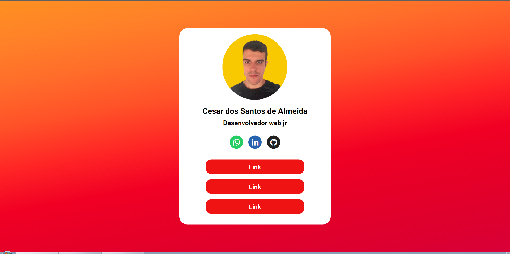

<h1 align="center"> Gerenciador de Links </h1>

    

Criação de uma página para gerenciamento de links

## Descrição

Criação de uma página para gerenciamento de links, facilitando a localização dos mesmos agrupados em um único lugar, foi baseado no [linktr.ee](https://linktr.ee/) a diferença está na personalização que foi feita nele, o Desenvolvimento teve início quando eu precisei de uma página aonde pode ser armazenar os meus links dos meus projetos que estão em outros servidores. Por isso acabei realizando esse projeto. Na pasta DOC você pode encontrar os prints das telas do projeto.

## Construído com

* [HTML](https://www.w3schools.com/html/) - HTML abreviação para a expressão inglesa HyperText Markup Language, que significa: "Linguagem de Marcação de Hipertexto" é uma linguagem de marcação utilizada na construção de páginas na Web. Documentos HTML podem ser interpretados por navegadores. A tecnologia é fruto da junção entre os padrões HyTime e SGML.

* [CSS](https://www.w3schools.com/css/default.asp) - Cascading Style Sheets é um mecanismo para adicionar estilo a um documento web. O código CSS pode ser aplicado diretamente nas tags ou ficar contido dentro das tags "style". Também é possível, em vez de colocar a formatação dentro do documento, criar um link para um arquivo CSS que contém os estilos.

* [SEO](https://www.quanzhanketang.com/website/web_search.html) - Otimização de Sites é o conjunto de estratégias com o objetivo de potencializar e melhorar o posicionamento de um site nas páginas de resultados naturais nos sites de busca gerando conversões, sejam elas, um lead, uma compra, um envio de formulário, agendamento de consulta e outros.

## Status do Projeto

**Concluido**: O projeto esta terminado, não havera futuras alterações de funcionalidade.

## Autor

* **Cesar dos Santos de Almeida** - *responsável pela construção e desenvolvimento do projeto*

## Licença
Este projeto está licenciado sob a licença MIT - consulte o arquivo  [LICENSE.md](LICENSE.md) para obter detalhes

## Links
* [Layout do projeto](https://www.figma.com/file/Sazdw51xQei4INZlfHzcQv/gerenciador-de-links?node-id=0%3A1) - Link do Layout Desenvolvido.
* [Demo](https://cesar959.github.io/gerenciamento-links/) - link da Demo Online.

